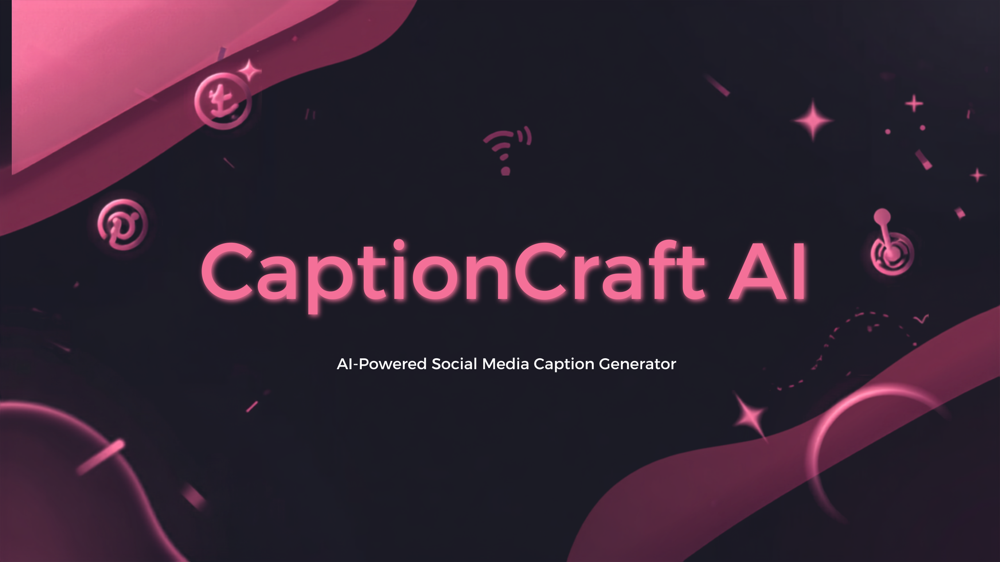
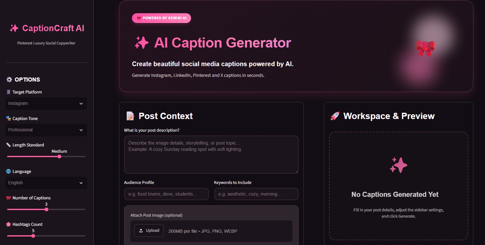
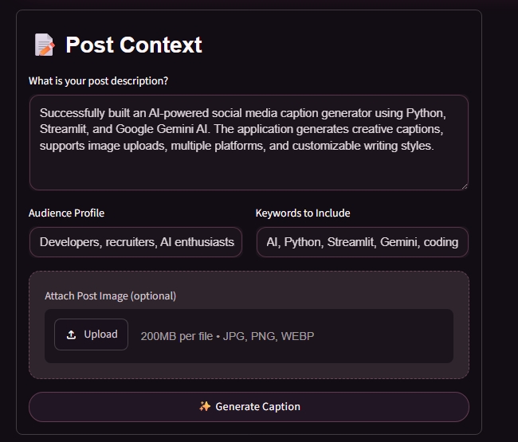
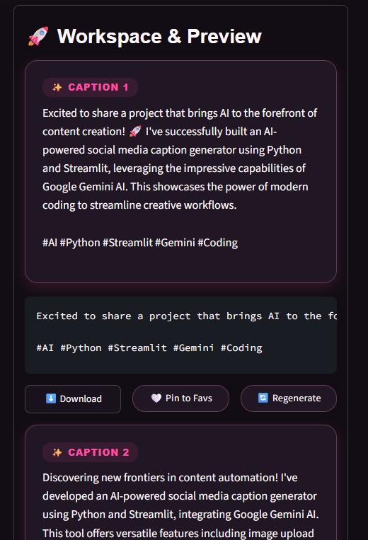
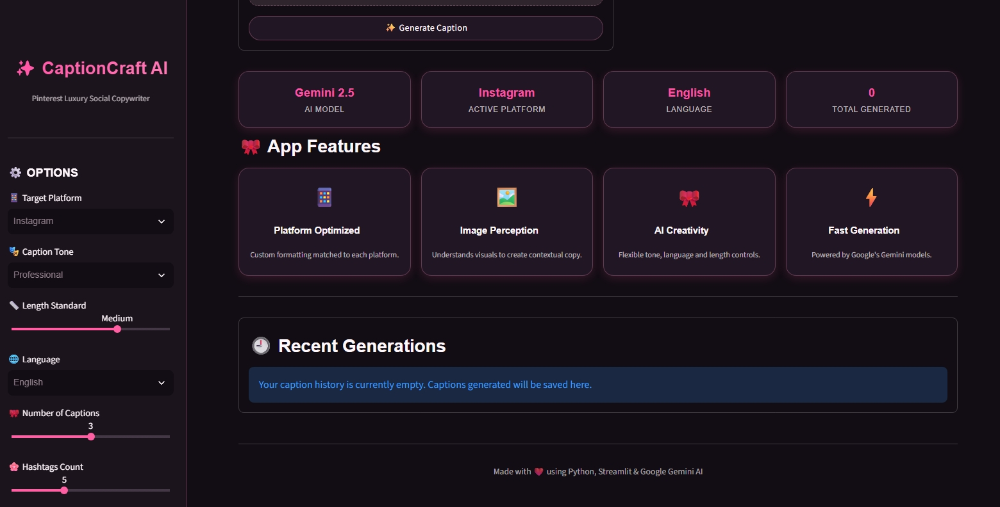

<div align="center">



# ✨ CaptionCraft AI

### AI-Powered Social Media Caption Generator

Generate engaging, platform-specific social media captions using **Google Gemini AI** with support for image understanding, multiple writing styles, multilingual output, and hashtag generation.

## 🌐 Live Demo

<a href="https://captioncraft-ai.streamlit.app/" target="_blank">
   <b>Launch CaptionCraft AI</b>
</a>


</div>

---

# 📖 Overview

CaptionCraft AI is a modern AI-powered web application that creates engaging, platform-specific social media captions using **Google Gemini AI**.

Users can provide a text description or upload an image, customize the writing style, language, hashtags, caption length, and target platform, then instantly receive multiple creative captions ready for publishing.

The application features a premium Pinterest-inspired interface built with **Python** and **Streamlit**.

---

# ✨ Features

- 🤖 AI-powered caption generation
- 🖼️ Image-based caption generation (Gemini Vision)
- 📱 Platform-specific captions
  - Instagram
  - LinkedIn
  - Facebook
  - X (Twitter)
  - Pinterest
- 🌍 Multi-language support
- 🎭 Multiple caption tones
- 📏 Adjustable caption length
- 😊 Emoji support
- #️⃣ Automatic hashtag generation
- 👥 Audience targeting
- 🔑 Custom keyword support
- ❤️ Save favorite captions
- 📄 Export captions as PDF
- 📥 Download captions as TXT
- 🕘 Caption history
- 🌙 Premium Pinterest-inspired dark UI

---

# 📸 Screenshots

## 🏠 Dashboard



---

## 📝 Post Context



---

## ✨ Generated Captions



---

## 🚀 Features & Recent History



---

# ⚙️ Tech Stack

### Frontend

- Streamlit

### Backend

- Python

### AI

- Google Gemini 2.5

### Libraries

- google-genai
- Pillow
- ReportLab
- python-dotenv

---

# 📂 Project Structure

```text
CaptionCraft-AI
│
├── app.py
├── ai_service.py
├── components.py
├── pdf_utils.py
├── prompts.py
├── styles.py
├── styles.css
├── utils.py
│
├── requirements.txt
├── README.md
├── LICENSE
├── .gitignore
│
├── assets
│   ├── banner.png
│   ├── home.png
│   ├── context.png
│   ├── captions.png
│   └── features.png
│
└── .streamlit
    └── config.toml
```

---

# 🚀 Installation

Clone the repository

```bash
git clone https://github.com/jasleen8948/captioncraft-ai.git
```

Move into the project

```bash
cd captioncraft-ai
```

Create a virtual environment

```bash
python -m venv .venv
```

Activate it

### Windows

```bash
.venv\Scripts\activate
```

### macOS/Linux

```bash
source .venv/bin/activate
```

Install dependencies

```bash
pip install -r requirements.txt
```

Create a `.env` file

```env
GEMINI_API_KEY=YOUR_API_KEY
```

Run the application

```bash
streamlit run app.py
```

---

# 💡 How It Works

```text
User Input
      │
      ▼
Describe Post / Upload Image
      │
      ▼
Customize Platform, Tone & Language
      │
      ▼
Google Gemini AI
      │
      ▼
Generate Multiple Captions
      │
      ▼
Download • Export PDF • Save Favorites
```

---

# 🎯 Supported Platforms

- 📷 Instagram
- 💼 LinkedIn
- 📘 Facebook
- 🐦 X (Twitter)
- 📌 Pinterest

---

# 🌟 Future Enhancements

- 📅 Social media scheduling
- 📈 Trending hashtag suggestions
- 🎬 Reel & YouTube caption generation
- 📊 Caption performance analytics
- 🌐 Additional language support
- ☁️ Cloud history synchronization

---

# 👩‍💻 Author

### Jasleen Kaur

📧 Email: **jasleenk2806@gmail.com**

🔗 LinkedIn  
https://www.linkedin.com/in/jasleen-kaur-jk

💻 GitHub  
https://github.com/jasleen8948

---

# 🤝 Contributing

Contributions are welcome!

Feel free to fork the repository, improve the project, and submit a pull request.

---

# 📜 License

This project is licensed under the **MIT License**.

---

<div align="center">

### ⭐ If you found this project useful, please give it a Star!

Made with ❤️ using **Python • Streamlit • Google Gemini AI**

</div>
